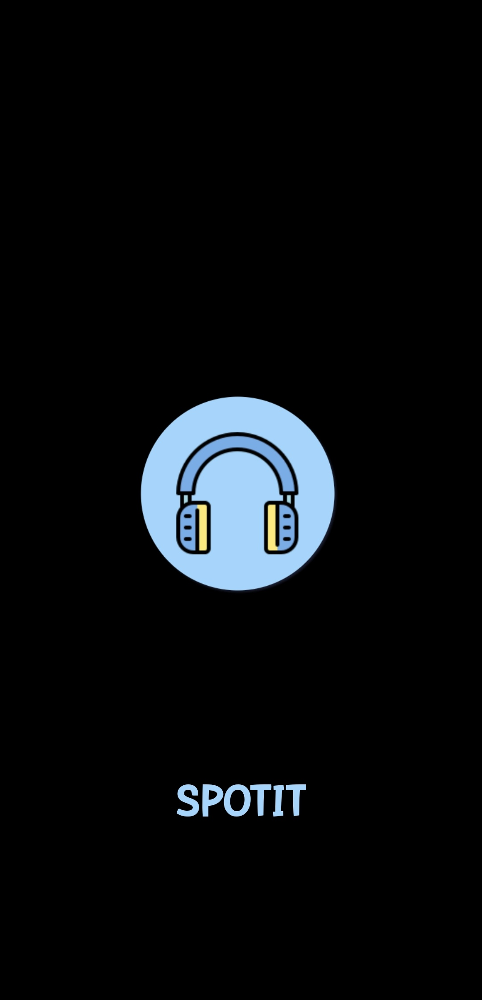
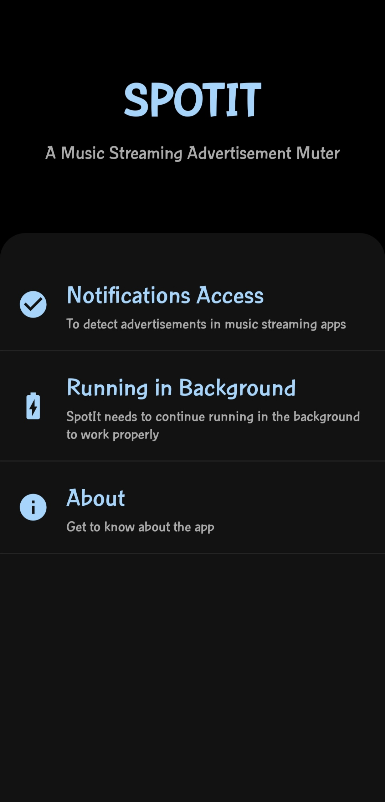

 
   

  <h1 align="center">SpotIt</h3>

  <h3 align="center">
    Music Streaming Advertisement Muter
  </h3>

  

  

  

##  👨🏻‍💻 About The Project
SpotIt is a music streaming advertisement muter. It works with popular music streaming services like Spotify, JioSaavn and Gaana. It detects advertisements using notifications and mutes the music streaming audio of your phone.
## :package: Download

## :framed_picture: Screenshots

## :bulb: How It Works
1. SpotIt listens for notifications from music streaming apps like Spotify, JioSaavn and Gaana using NotificationListenerService.
2. Then it searches for words like "advertisement", "sponsored ad" in the notification's data.
3. If the advertisement words are found then it mutes the music streaming audio (STREAM_MUSIC) of a device using AudioManager.

## :smiley: Privacy
1. The app does not collect any private data and does not require any network permissions.
2. It uses user notifications to detect advertisements in music streaming services and does not <b>"hack"</b> protection measures of music streaming services

## :construction_worker: Issues and Feature requests
If you found a bug, or have an idea for new functionality, feel free to report it on the issue tracker.
